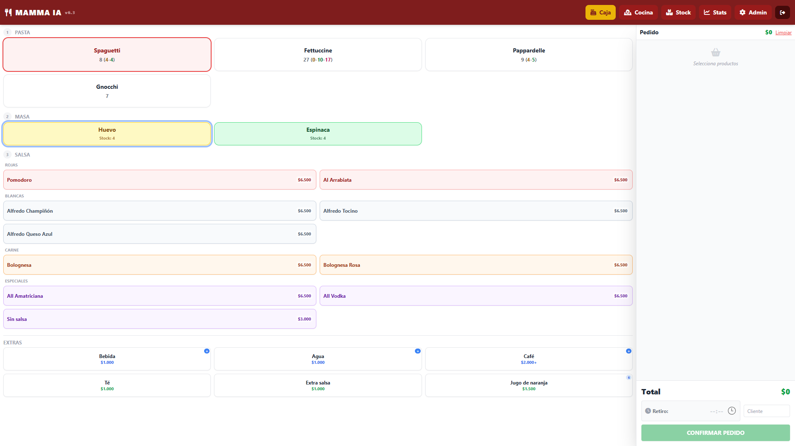

# Mamma Ia POS

Sistema de punto de venta en tiempo real diseñado para food trucks y pequeños restaurantes. Construido con Alpine.js, Tailwind CSS y Firebase.

**[Ver Demo en Vivo](https://subtle-llama-2eaf80.netlify.app/)** · **[Video Demo](https://youtube.com/shorts/QJquPr44j8A?si=Hxge0y-YKB30rX97])**
**PIN de acceso:** `123456`


## Caracteristicas

- **Punto de Venta** — Selección de pasta → masa → salsa con control de stock en tiempo real
- **Vista Cocina** — Pantalla dedicada con notificaciones sonoras, drag & drop para priorizar pedidos, y modo simplificado
- **Inventario** — Control de stock por combinación pasta/masa con transacciones atómicas en Firebase
- **Estadísticas** — Gráficos de venta por día/hora, rankings de productos, tiempos de preparación, export CSV
- **Multi-rol** — Acceso Admin (completo) e Invitado (solo caja) con autenticación por PIN
- **Cuentas divididas** — Separar un pedido en múltiples cuentas
- **Pedidos programados** — Agendar pedidos para una hora específica
- **Responsive** — Optimizado para tablet y móvil con soporte iOS safe areas
- **Tiempo real** — Sincronización instantánea entre caja y cocina via Firebase Realtime DB

## Stack Técnico

| Tecnología | Uso |
|---|---|
| [Alpine.js](https://alpinejs.dev/) | Reactividad del UI — elegido por su bajo peso (~15KB) ideal para dispositivos limitados |
| [Tailwind CSS](https://tailwindcss.com/) | Estilos utility-first |
| [Firebase Realtime DB](https://firebase.google.com/docs/database) | Base de datos en tiempo real + auth anónima |
| [Chart.js](https://www.chartjs.org/) | Gráficos de estadísticas |
| [SortableJS](https://sortablejs.github.io/Sortable/) | Drag & drop en vista cocina |

## Arquitectura

El sistema usa un patrón modular sin bundler. Cada módulo es un IIFE que registra su estado y métodos en un namespace global (`MammaIA`), y Alpine.js consume el objeto final.

```
namespace.js → Crea MammaIA global con register() y createApp()
config.js    → Menú default (pastas, masas, salsas, extras)
utils.js     → Helpers: fechas, formateo, notificaciones
auth.js      → Login por PIN, sesiones, roles
stock.js     → Inventario con transacciones atómicas
cart.js      → Carrito y división de cuentas
orders.js    → CRUD de pedidos + listeners en tiempo real
kitchen.js   → Vista cocina, sonidos, modo simplificado
stats.js     → Cálculos y gráficos
admin.js     → CRUD del menú
app.js       → Init, computed properties, bootstrap
```

## Instalación

1. Clona el repositorio
```bash
git clone https://github.com/tu-usuario/mamma-ia-pos.git
cd mamma-ia-pos
```

2. Crea tu proyecto en [Firebase Console](https://console.firebase.google.com/)
   - Activa Realtime Database
   - Activa Authentication > Anonymous sign-in
   - Copia las credenciales

3. Configura Firebase
```bash
cp firebase-config.example.js firebase-config.js
# Edita firebase-config.js con tus credenciales
```

4. Aplica las security rules
   - Ve a Firebase Console > Realtime Database > Rules
   - Copia el contenido de `firebase.rules.json`

5. Sirve localmente
```bash
# Cualquier servidor estático funciona
npx serve .
# o
python3 -m http.server 8080
```

6. Abre `http://localhost:8080` — PIN por defecto: `123456` (admin) / `0000` (invitado)

## Screenshots

> Agrega capturas en `docs/` y referéncialas aquí

## Decisiones de Diseño

- **¿Por qué Alpine.js en vez de React/Vue?** El sistema corre en tablets económicas dentro de un food truck. Alpine.js pesa ~15KB vs ~40KB+ de React, no requiere build step, y su reactividad declarativa es ideal para un SPA simple. La ausencia de bundler permite editar y deployar en segundos.

- **¿Por qué Firebase Realtime DB?** La sincronización en tiempo real entre el dispositivo de caja y la pantalla de cocina es un requisito core. Firebase lo resuelve con listeners nativos, sin necesidad de WebSocket server propio. El plan gratuito cubre el volumen de un food truck.

- **¿Por qué no hay backend?** Firebase maneja autenticación, base de datos y reglas de seguridad. Para un POS de bajo volumen, un backend tradicional agregaría complejidad y costos de hosting sin beneficios claros. Las security rules de Firebase protegen los datos.

- **¿Por qué ES5 syntax?** Compatibilidad máxima con navegadores antiguos en tablets económicas, sin necesidad de transpilación.

## Estructura del Proyecto

```
/
├── index.html              # SPA principal
├── css/
│   └── styles.css          # Estilos custom (complementa Tailwind)
├── js/
│   ├── namespace.js        # Sistema de módulos
│   ├── config.js           # Configuración default del menú
│   ├── utils.js            # Utilidades y constantes
│   ├── auth.js             # Autenticación por PIN
│   ├── stock.js            # Gestión de inventario
│   ├── cart.js             # Carrito de compras
│   ├── orders.js           # CRUD de pedidos
│   ├── kitchen.js          # Vista cocina
│   ├── stats.js            # Estadísticas y gráficos
│   ├── admin.js            # Administración del menú
│   └── app.js              # Bootstrap de la aplicación
├── firebase-config.example.js  # Template de configuración
├── firebase.rules.json     # Security rules para Firebase
├── .gitignore
├── .editorconfig
├── .eslintrc.json
├── LICENSE
└── README.md
```

## Licencia

MIT License - ver [LICENSE](LICENSE) para más detalles.
